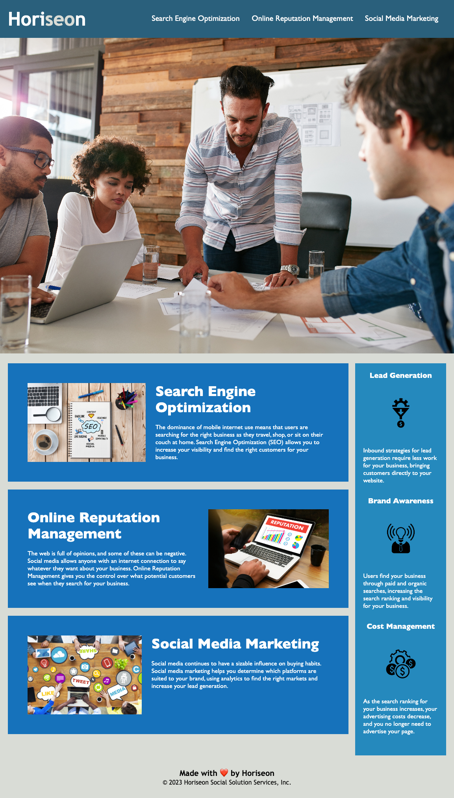

# horiseonmktg
# 01 HTML, CSS, and Git: Code Refactor
First Challenge for Bootcamp - Horiseon Marketing

## Description

### Tasks completed
* Changed DIV to SECTION for Semantics
* Added notes for future ease to both HTML and CSS
* Added Title to improve Search SEO
* Improved accessibilty critera by adding alt attributes to images
* Added Header
* Added Navigation
* Fixed Anchor Links
* Cleaned up list

### Links

[Link to the deployed website]()

[Link to the code repository]()

### Resources Used
* 